# Лабораторная работа №2. Облачные вычислительные сервисы. Amazon EC2

## Цель работы
Научиться запускать и настраивать виртуальные машины Amazon EC2, подключаться к ним по SSH, диагностировать их состояние и разворачивать на них веб-приложение: от статической страницы до настоящего приложения с базой данных, которое сервер сам забирает из репозитория GitHub.

# Часть 1. Базовый уровень
## Задание 1. Подготовка аккаунта

Я создала нового IAM-пользователя и добавила его в группу Admins

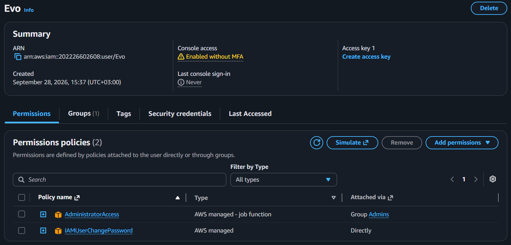

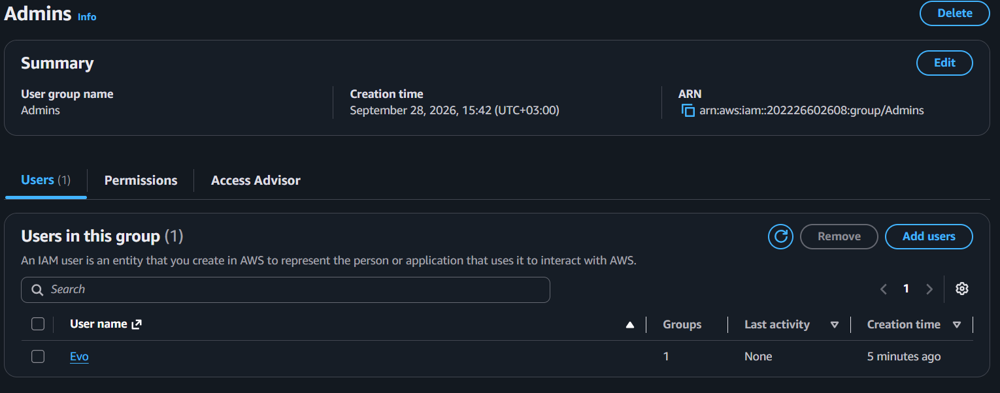

И обезопасила свои кровные:

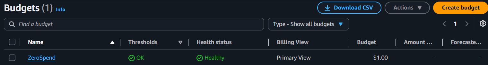

## Задание 2. Запуск экземпляра EC2

- Name: webserver.
- AMI: Amazon Linux 2023.
- Instance type: t3.micro.
- Key pair: yournickname-keypair, тип ED25519, формат .pem.
- Network settings: default VPC и включённый публичный IP. 

- Configure storage: default.
- Advanced details → User data:

```bash
#!/bin/bash
dnf -y update
dnf -y install htop nginx
systemctl enable --now nginx
```

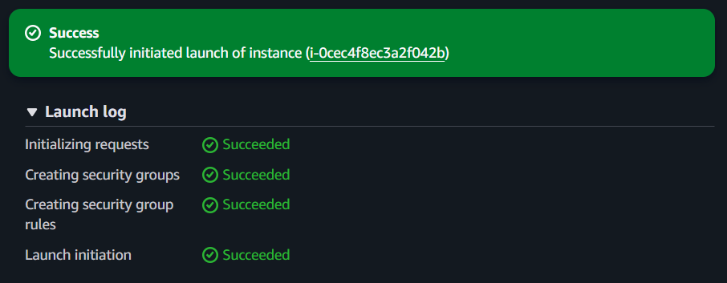

Перехожу по ссылке http://63.178.221.188/

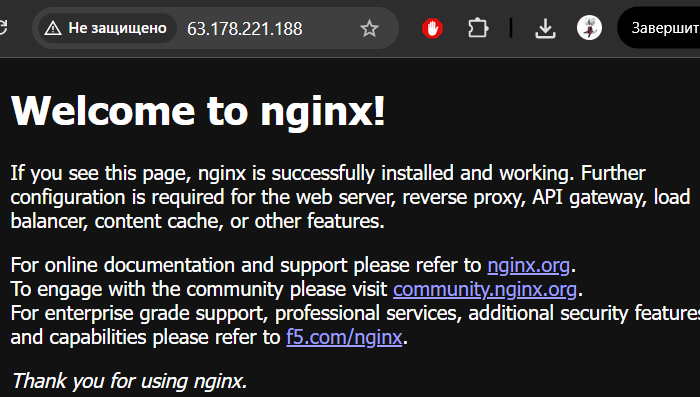

Если вижу приветственную страницу nginx, значит все правильно.

## Задание 3. Мониторинг и диагностика

**Status checks.**

- System status check проверяет инфраструктуру AWS: физический сервер и сеть, на которых работает экземпляр;
- Instance status check проверяет саму виртуальную машину: загрузилась ли операционная система и отвечает ли она;
- Attached EBS status check проверяет, доступны ли подключённые тома EBS.

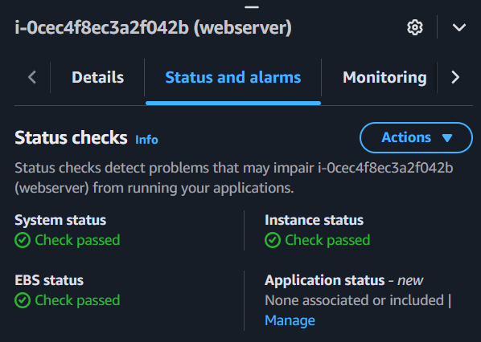

> Какая из проверок укажет на проблему, которую можете исправить вы, а какая на проблему на стороне AWS?

Instance status check указывает на проблемы внутри самой виртуальной машины, например ошибки загрузки ОС или сетевой конфигурации. Такие проблемы обычно может исправить пользователь.
System status check показывает проблемы с инфраструктурой AWS, например с физическим сервером или сетью, и это уже проблема на стороне AWS.
EBS status check показывает доступность подключённого диска EBS; проблема может быть связана с хранилищем AWS или подключением тома.

**Monitoring.**

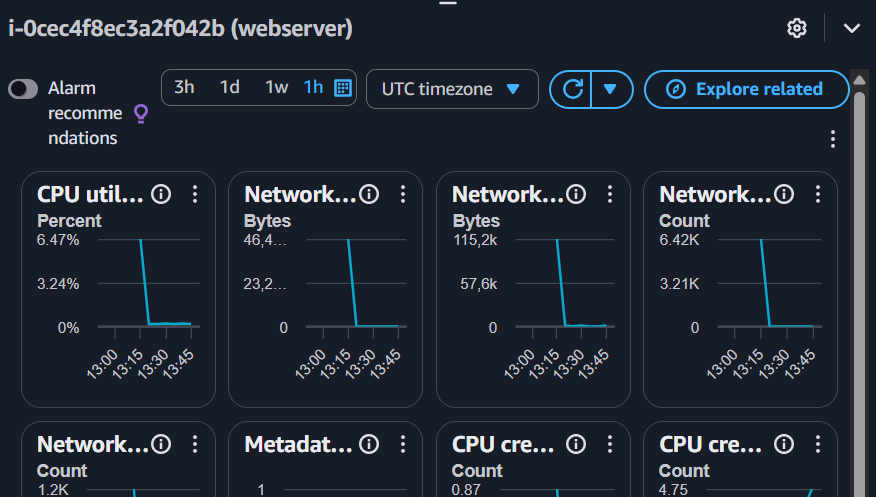

> В каких случаях стоит включать детальный мониторинг?

Детальный мониторинг стоит включать, когда нужно получать метрики чаще, примерно раз в минуту, а не раз в 5 минут. Это полезно для нагруженных production-серверов, поиска кратковременных скачков нагрузки, настройки CloudWatch alarms и Auto Scaling.
Для учебной EC2-машины обычно достаточно базового мониторинга, тем более что detailed monitoring оплачивается отдельно.

**System log.**

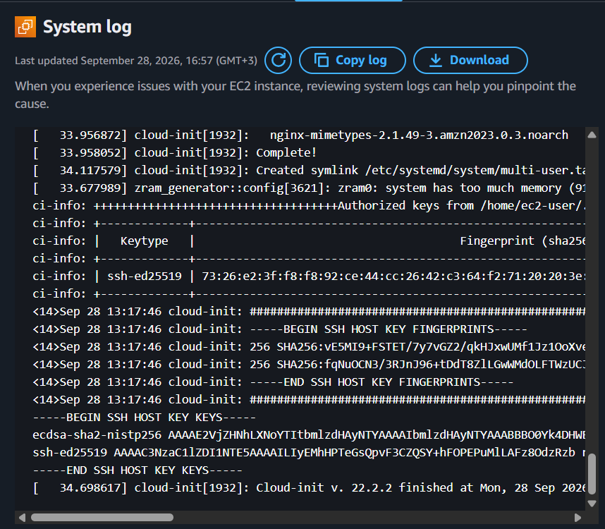

**Instance screenshot.**

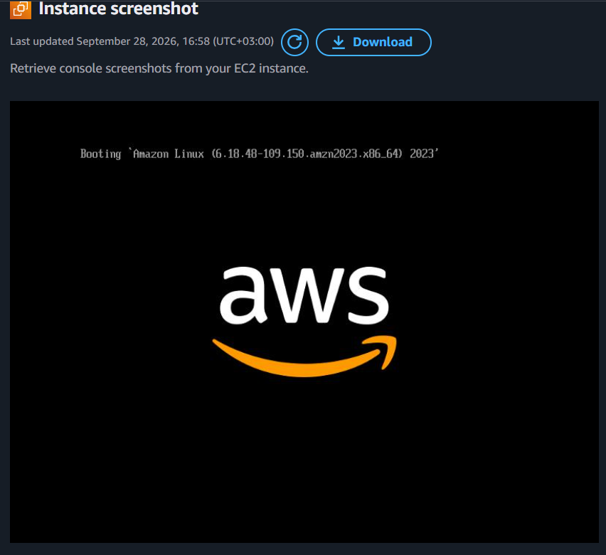

## Задание 4. Подключение по SSH

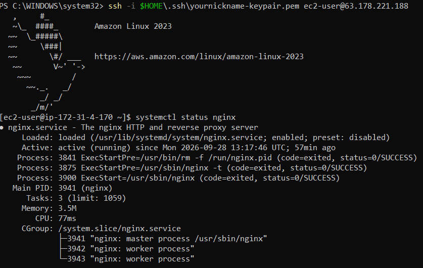

## Задание 5. Статический сайт

Я создала три файла:
- index.html
- about.html
- contact.html

Получился совсем небольшой сайт.

Скопировала их на сервер:
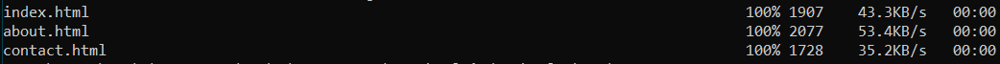

Подключаюсь к серверу по SSH и перекладываю файлы в папку, из которой nginx отдаёт страницы:

```bash
sudo cp ~/*.html /usr/share/nginx/html/
ls -l /usr/share/nginx/html
```

В итоге теперь вместо приветственной страницы nginx мы видим мой мини-сайт

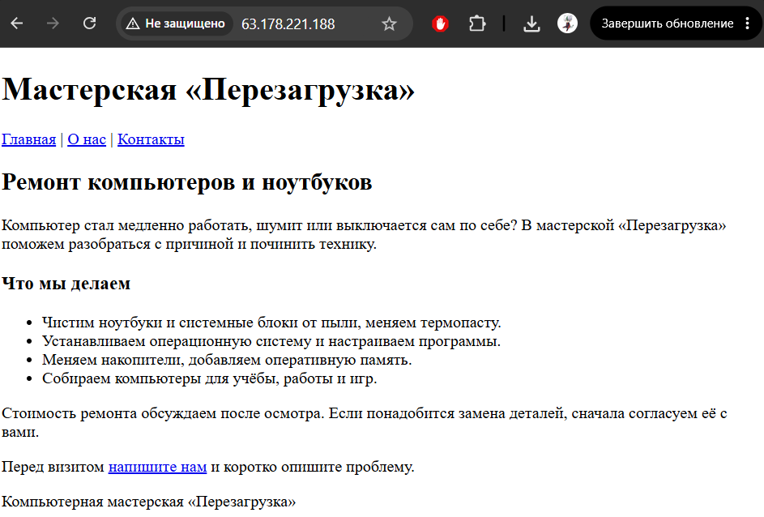

## Задание 6. Остановка экземпляра через AWS CLI

С помощью команды

```bash
aws ec2 stop-instances --instance-ids  i-0cec4f8ec3a2f042b --region eu-central-1
```
останавливаю экземпляр.

> Чем Stop отличается от Terminate? За что вы продолжаете платить, пока экземпляр остановлен?

Stop — временно выключает сервер: потом можно включить, файлы на EBS сохраняются.
Terminate — удаляет сервер окончательно. Диски удаляются, если включено их удаление вместе с сервером.
Пока сервер остановлен, платишь за диски EBS, снимки дисков и выделенный Elastic IP, если они есть. За вычислительные ресурсы On-Demand плата не идёт.